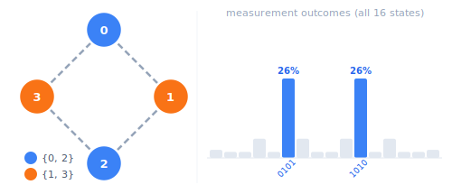
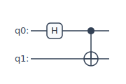
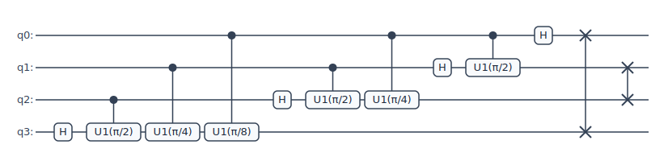
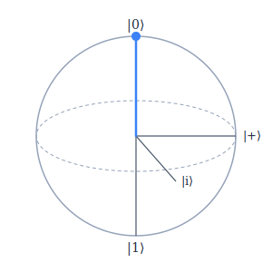
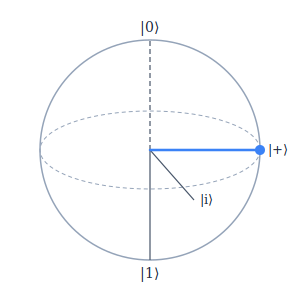
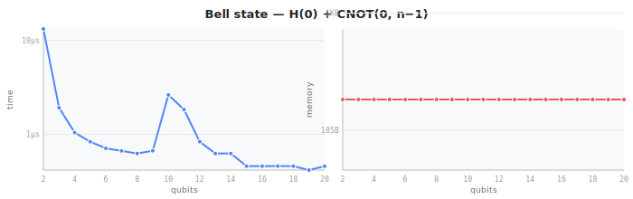
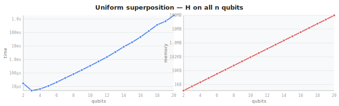
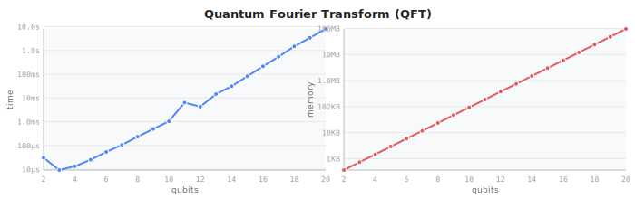

# ket

[](https://github.com/dmvjs/ket/actions/workflows/test.yml)
[](https://www.npmjs.com/package/@kirkelliott/ket)
[](LICENSE)

TypeScript quantum circuit simulator. Immutable API, four backends, 14 import/export formats, zero dependencies.

## Why ket

- **Immutable by design** — every gate method returns a new `Circuit`. Safe to compose, branch, and reuse.
- **TypeScript-strict, zero runtime dependencies** — not a JavaScript library with bolted-on types.
- **BigInt state indices** — handles 30+ qubits without 32-bit integer overflow.
- **Bounds-checked** — every qubit index is validated at gate-construction time; out-of-range indices throw `RangeError` immediately rather than silently corrupting state.
- **Four simulation backends** — statevector, MPS/tensor network, exact density matrix, and Clifford stabilizer in one library.
- **14 import/export formats** — more than any comparable JavaScript quantum library.
- **Algorithm library built-in** — QFT, Grover's search, QPE, VQE, and Trotterized Hamiltonian simulation ship with the core.

## Install

```bash
npm install @kirkelliott/ket
```

Or load directly in a browser:

```html
<script type="module">
  import { Circuit } from 'https://unpkg.com/@kirkelliott/ket/dist/ket.js'

  const bell = new Circuit(2).h(0).cnot(0, 1)
  console.log(bell.stateAsString())  // 0.7071|00⟩ + 0.7071|11⟩
</script>
```

The ESM bundle is 174kb unminified / ~20kb gzipped. No external dependencies.

Requires Node.js ≥ 22 for server-side use.

## Quick start

### Bell state — draw and run

```typescript
import { Circuit } from '@kirkelliott/ket'

const bell = new Circuit(2).h(0).cnot(0, 1)

console.log(bell.draw())
// q0: ─H──●─
//          │
// q1: ─────⊕─

console.log(bell.stateAsString())
// 0.7071|00⟩ + 0.7071|11⟩

console.log(bell.exactProbs())
// { '00': 0.5, '11': 0.5 }

// Add measurement for shot-based sampling
const result = bell
  .creg('out', 2)
  .measure(0, 'out', 0)
  .measure(1, 'out', 1)
  .run({ shots: 1000, seed: 42 })
// result.probs → { '00': ~0.5, '11': ~0.5 }
```

### Clifford simulation

```typescript
import { Circuit } from '@kirkelliott/ket'

// runClifford accepts only Clifford gates: H, S, S†, X, Y, Z, CNOT, CZ, CY, SWAP
let ghz = new Circuit(5).h(0)
for (let i = 0; i < 4; i++) ghz = ghz.cnot(i, i + 1)
ghz = ghz.creg('out', 5)
for (let i = 0; i < 5; i++) ghz = ghz.measure(i, 'out', i)

const result = ghz.runClifford({ shots: 1024, seed: 42 })
// result.probs → { '00000': ~0.5, '11111': ~0.5 }

// Add noise — same interface as statevector/density matrix
ghz.runClifford({ shots: 10000, noise: 'aria-1' })
ghz.runClifford({ shots: 10000, noise: { p1: 0.001, p2: 0.005, pMeas: 0.004 } })
```

Non-Clifford gates throw at runtime:

```typescript
new Circuit(2).t(0).runClifford()
// TypeError: runClifford: gate 't' is not a Clifford gate
```

### Noise and density matrix

```typescript
import { Circuit } from '@kirkelliott/ket'

const circuit = new Circuit(2).h(0).cnot(0, 1)

// Run with a named device noise profile
const dm = circuit.dm({ noise: 'aria-1' })

console.log(dm.purity())     // < 1 under depolarizing noise
console.log(dm.entropy())    // von Neumann entropy in bits
console.log(dm.blochAngles(0))  // { theta, phi } for qubit 0
console.log(dm.probabilities()) // { '00': ..., '01': ..., ... }
```

## Simulation backends

| Backend | Method | Memory | Best for |
|---|---|---|---|
| Statevector | `circuit.run()` / `circuit.statevector()` | O(2ⁿ), sparse | Exact simulation, practical up to ~20 qubits |
| MPS / tensor network | `circuit.runMps({ shots, maxBond? })` | O(n·χ²) | Low-entanglement circuits, 50+ qubits |
| Exact density matrix | `circuit.dm({ noise? })` | O(4ⁿ), sparse | Mixed-state and noisy simulation |
| Clifford stabilizer | `circuit.runClifford({ shots, noise? })` | O(n²) | Clifford-only circuits, QEC threshold curves |

The MPS backend runs GHZ-50 in milliseconds at bond dimension χ=2. The density matrix backend uses a Jacobi eigenvalue solver for von Neumann entropy and is practical up to n=12. The Clifford backend accepts only gates in {H, S, S†, X, Y, Z, CNOT, CZ, CY, SWAP} and throws if the circuit contains non-Clifford gates (T, Rx, etc.).

All backends accept an `initialState` option to start from an arbitrary computational basis state instead of |0...0⟩:

```typescript
// Start from |110⟩ (q0=0, q1=1, q2=1)
circuit.run({ initialState: '110' })
circuit.runMps({ shots: 1000, initialState: '110' })
circuit.statevector({ initialState: '110' })
```

## Gates

### Single-qubit

| Gate | Method | Description |
|---|---|---|
| H | `h(q)` | Hadamard |
| X | `x(q)` | Pauli-X (NOT) |
| Y | `y(q)` | Pauli-Y |
| Z | `z(q)` | Pauli-Z |
| S | `s(q)` | Phase (Rz(π/2)) |
| S† | `si(q)` / `sdg(q)` | S-inverse |
| T | `t(q)` | T gate (Rz(π/4)) |
| T† | `ti(q)` / `tdg(q)` | T-inverse |
| V | `v(q)` / `srn(q)` | √X |
| V† | `vi(q)` / `srndg(q)` | √X-inverse |
| Rx | `rx(θ, q)` | X-axis rotation |
| Ry | `ry(θ, q)` | Y-axis rotation |
| Rz | `rz(θ, q)` | Z-axis rotation |
| R2 | `r2(q)` | Rz(π/2) alias |
| R4 | `r4(q)` | Rz(π/4) alias |
| R8 | `r8(q)` | Rz(π/8) alias |
| U1 | `u1(λ, q)` / `p(λ, q)` | Phase gate (p = Qiskit 1.0+ name) |
| U2 | `u2(φ, λ, q)` | Two-parameter unitary |
| U3 | `u3(θ, φ, λ, q)` | General single-qubit unitary |
| VZ | `vz(θ, q)` | VirtualZ (Rz alias) |
| I | `id(q)` | Identity |

### Two-qubit

| Gate | Method | Description |
|---|---|---|
| CNOT | `cnot(c, t)` | Controlled-X |
| SWAP | `swap(q0, q1)` | SWAP |
| CX | `cx(c, t)` | Controlled-X (alias) |
| CY | `cy(c, t)` | Controlled-Y |
| CZ | `cz(c, t)` | Controlled-Z |
| CH | `ch(c, t)` | Controlled-H |
| CRx | `crx(θ, c, t)` | Controlled-Rx |
| CRy | `cry(θ, c, t)` | Controlled-Ry |
| CRz | `crz(θ, c, t)` | Controlled-Rz |
| CR2 | `cr2(c, t)` | Controlled-R2 |
| CR4 | `cr4(c, t)` | Controlled-R4 |
| CR8 | `cr8(c, t)` | Controlled-R8 |
| CU1 | `cu1(λ, c, t)` | Controlled-U1 |
| CU2 | `cu2(φ, λ, c, t)` | Controlled-U2 |
| CU3 | `cu3(θ, φ, λ, c, t)` | Controlled-U3 |
| CS | `cs(c, t)` | Controlled-S |
| CT | `ct(c, t)` | Controlled-T |
| CS† | `csdg(c, t)` | Controlled-S† |
| CT† | `ctdg(c, t)` | Controlled-T† |
| C√X | `csrn(c, t)` | Controlled-√NOT |
| XX | `xx(θ, q0, q1)` | Ising XX interaction |
| YY | `yy(θ, q0, q1)` | Ising YY interaction |
| ZZ | `zz(θ, q0, q1)` | Ising ZZ interaction |
| XY | `xy(θ, q0, q1)` | XY interaction |
| iSWAP | `iswap(q0, q1)` | iSWAP |
| √iSWAP | `srswap(q0, q1)` | Square-root iSWAP |

### Three-qubit

| Gate | Method | Description |
|---|---|---|
| CCX | `ccx(c0, c1, t)` | Toffoli |
| CSWAP | `cswap(c, q0, q1)` | Fredkin |
| C√SWAP | `csrswap(c, q0, q1)` | Controlled-√SWAP |

### Scheduling

| Method | Description |
|---|---|
| `barrier(...qubits)` | Scheduling hint — no-op in simulation, emits `barrier` in QASM. No args = all qubits. |

### Native IonQ gates

| Gate | Method | Description |
|---|---|---|
| GPI | `gpi(φ, q)` | Single-qubit rotation on Bloch equator |
| GPI2 | `gpi2(φ, q)` | Half-angle GPI |
| MS | `ms(φ₀, φ₁, q0, q1)` | Mølmer-Sørensen entangling gate |

## IonQ device targeting

ket models IonQ hardware devices with qubit capacity, native gate sets, and published noise figures in one place.

```typescript
import { IONQ_DEVICES, Circuit } from '@kirkelliott/ket'

// Query device specs
const aria = IONQ_DEVICES['aria-1']
// { qubits: 25, nativeGates: ['gpi', 'gpi2', 'ms', 'vz'], noise: { p1, p2, pMeas } }

// Validate a circuit before submitting
const circuit = new Circuit(2).h(0).cnot(0, 1)
circuit.checkDevice('aria-1')   // passes — h and cnot are in the IonQ abstract gate set
circuit.toIonQ()                // safe to call

// checkDevice throws with all issues at once
new Circuit(30).cu1(Math.PI / 4, 0, 1).checkDevice('harmony')
// TypeError: Circuit is not compatible with harmony:
//   - circuit uses 30 qubits; harmony supports at most 11
//   - gate 'cu1' is not supported on harmony

// Run simulation with device noise
circuit.run({ shots: 1000, noise: 'forte-1' })
circuit.dm({ noise: 'aria-1' })
```

| Device | Qubits | Native gates | p1 (1Q) | p2 (2Q) | pMeas |
|---|---|---|---|---|---|
| `aria-1` | 25 | GPI, GPI2, MS, VZ | 0.03% | 0.50% | 0.40% |
| `forte-1` | 36 | GPI, GPI2, MS, VZ, ZZ | 0.01% | 0.20% | 0.20% |
| `harmony` | 11 | GPI, GPI2, MS, VZ | 0.10% | 1.50% | 1.00% |

## Import / Export

| Format | Import | Export | Method(s) |
|---|---|---|---|
| OpenQASM 2.0 / 3.0 | ✓ | ✓ (2.0) | `Circuit.fromQASM(s)` / `circuit.toQASM()` |
| IonQ JSON | ✓ | ✓ | `Circuit.fromIonQ(json)` / `circuit.toIonQ()` |
| Quil 2.0 | ✓ | ✓ | `Circuit.fromQuil(s)` / `circuit.toQuil()` |
| JSON (native) | ✓ | ✓ | `Circuit.fromJSON(json)` / `circuit.toJSON()` |
| Qiskit (Python) | ✓ | ✓ | `Circuit.fromQiskit(s)` / `circuit.toQiskit()` |
| Qiskit Qobj JSON | ✓ | — | `Circuit.fromQobj(json)` |
| Cirq (Python) | ✓ | ✓ | `Circuit.fromCirq(s)` / `circuit.toCirq()` |
| Q# | — | ✓ | `circuit.toQSharp()` |
| pyQuil | — | ✓ | `circuit.toPyQuil()` |
| Amazon Braket | — | ✓ | `circuit.toBraket()` |
| CudaQ | — | ✓ | `circuit.toCudaQ()` |
| TensorFlow Quantum | — | ✓ | `circuit.toTFQ()` |
| Quirk JSON | — | ✓ | `circuit.toQuirk()` |
| LaTeX (quantikz) | — | ✓ | `circuit.toLatex()` |

## Algorithms

```typescript
import { Circuit, qft, iqft, grover, phaseEstimation, vqe, trotter, qaoa, maxCutHamiltonian } from '@kirkelliott/ket'

// Quantum Fourier Transform
const qftCircuit = qft(4)
const iqftCircuit = iqft(4)

// Grover's search — find the marked state
const oracle = (c: Circuit) => c.cz(0, 1)  // mark |11⟩
const search = grover(2, oracle)

// Quantum Phase Estimation — estimates phase of T gate (φ = 1/8)
// T|1⟩ = e^{iπ/4}|1⟩; controlled-T^{2^k} = CU1(π·2^k/4)
// precision=3 counting qubits (q0–q2) + 1 target qubit (q3)
const qpe = phaseEstimation(3,
  (c, ctrl, pow, tgts) => c.cu1(Math.PI * pow / 4, ctrl, tgts[0]!), 1)
// Initialise target qubit (q3) to eigenstate |1⟩ via initialState
const result = qpe.run({ shots: 1000, seed: 42, initialState: '1000' })
// Phase φ=1/8 → counting register = |001⟩ → dominant bitstring '1001'

// Variational Quantum Eigensolver
const ansatz = new Circuit(2).ry(Math.PI / 4, 0).cnot(0, 1)
const hamiltonian = [{ coeff: 0.5, ops: 'ZI' }, { coeff: 0.5, ops: 'IZ' }]
const energy = vqe(ansatz, hamiltonian)  // ⟨ψ|H|ψ⟩

// Trotterized Hamiltonian simulation — e^{-iHt} ≈ (∏_j e^{-iH_j·t/r})^r
const H = [{ coeff: 1.0, ops: 'ZZ' }, { coeff: 0.5, ops: 'XX' }]
const evolution = trotter(2, H, Math.PI / 4, 4, 2)  // 4 steps, order 2

// QAOA Max-Cut — 4-cycle graph, p=1
const edges: [number, number][] = [[0,1],[1,2],[2,3],[3,0]]
const circuit = qaoa(4, edges, [Math.PI / 4], [0.15 * Math.PI])
vqe(circuit, maxCutHamiltonian(4, edges))  // → ~2.95  (random = 2.0, optimal = 4.0)
circuit.exactProbs()
// Top states: '1010': 0.265, '0101': 0.265  ← the two optimal bipartitions
```

`trotter(n, hamiltonian, t, steps?, order?)` implements the Lie–Trotter product formula (`order=1`) and the symmetric Trotter–Suzuki decomposition (`order=2`). Error scales as O(t²/r) for order 1 and O(t³/r²) for order 2.

`qaoa(n, edges, gamma, beta)` builds the QAOA circuit (Farhi et al. 2014) for the Max-Cut problem. Each layer applies a cost unitary (ZZ rotation per edge) and a mixer unitary (Rx per qubit). `maxCutHamiltonian(n, edges)` returns the corresponding Pauli-string Hamiltonian for `vqe` to evaluate the expected cut value exactly.

QAOA p=1 on a 4-cycle — the two optimal bipartitions tower over all 16 possible outcomes:



## Visualization

### ASCII diagram

`circuit.draw()` renders a text-mode diagram suitable for terminals, notebooks, and log output.

```
q0: ─H──●──M─
         │
q1: ─────⊕──M─
```

Gates on non-conflicting qubits share a column. Parameterized gates display their angle: `Rx(π/4)`, `XX(π/2)`. Named sub-circuit gates show their registered name.

### SVG export

`circuit.toSVG()` returns a self-contained SVG string with no external fonts or stylesheets. The layout matches `draw()`: same column packing, rounded gate boxes, filled control dots, circle-cross CNOT targets, and × SWAP marks. Safe to write directly to `.svg` files or inline in HTML.

Bell state:



4-qubit QFT:



### Bloch sphere

`circuit.blochSphere(q)` returns a self-contained SVG showing the single-qubit state for qubit `q` as an arrow on the Bloch sphere. Internally uses `blochAngles(q)`, which partial-traces the statevector over all other qubits.

|0⟩ state (north pole) and |+⟩ = H|0⟩ state (equator):

 

```typescript
// Write to file
import fs from 'fs'
fs.writeFileSync('state.svg', circuit.blochSphere(0))
```

### LaTeX

`circuit.toLatex()` emits a `quantikz` LaTeX environment with `\frac{\pi}{n}` angle formatting, proper `\ctrl{}`, `\targ{}`, `\swap{}`, `\gate[2]{}`, and `\meter{}` commands.

## State inspection

```typescript
const circuit = new Circuit(2).h(0).cnot(0, 1)

circuit.statevector()           // Map<bigint, Complex> — full sparse amplitude map
circuit.amplitude('11')         // Complex — amplitude of |11⟩
circuit.probability('11')       // number — |amplitude|²
circuit.exactProbs()            // { '00': 0.5, '11': 0.5 } — no sampling, no variance
circuit.marginals()             // [P(q0=1), P(q1=1)]
circuit.stateAsString()         // '0.7071|00⟩ + 0.7071|11⟩'
circuit.blochAngles(0)          // { theta, phi } via partial trace
```

## Classical control and named gates

```typescript
import { Circuit } from '@kirkelliott/ket'

// Classical registers, measurement, and reset
const c = new Circuit(2)
  .creg('out', 2)
  .h(0)
  .cnot(0, 1)
  .measure(0, 'out', 0)
  .measure(1, 'out', 1)
  .reset(0)

// Conditional gate application
const teleport = new Circuit(3)
  .if('out', 1, q => q.x(2))
  .if('out', 2, q => q.z(2))

// Named sub-circuit gates
const bell = new Circuit(2).h(0).cnot(0, 1)
const main = new Circuit(4)
  .defineGate('bell', bell)
  .gate('bell', 0, 1)
  .gate('bell', 2, 3)

main.decompose()  // inline all named gates back to primitives
```

## Noise models

All three stochastic backends accept a noise configuration with the same interface:

```typescript
// Named device profile (statevector, Clifford, density matrix)
circuit.run({ noise: 'aria-1' })
circuit.runClifford({ shots: 10000, noise: 'forte-1' })
circuit.dm({ noise: 'harmony' })

// Custom noise parameters
circuit.run({ noise: { p1: 0.001, p2: 0.005, pMeas: 0.004 } })
circuit.runClifford({ shots: 10000, noise: { p1: 0.001, p2: 0.005 } })
```

`p1` — single-qubit depolarizing error probability per gate. `p2` — two-qubit depolarizing probability. `pMeas` — bit-flip probability on each measured bit (SPAM error).

Named profiles match the device table in [IonQ device targeting](#ionq-device-targeting). The density matrix backend applies exact per-gate depolarizing channels (no Monte Carlo sampling). Noiseless circuits take the fast path — zero overhead.

## Serialization

```typescript
// Lossless round-trip through JSON
const json = circuit.toJSON()
const restored = Circuit.fromJSON(json)

// Or pass a parsed object
const restored2 = Circuit.fromJSON(JSON.parse(json))
```

All operation types are preserved: gates, measure, reset, if, and named sub-circuits. Gate matrices are reconstructed from metadata on load.

## Performance

Measured on GitHub Actions `ubuntu-latest` (2-core, Node.js 22). Charts auto-update on every push to main.

Statevector is exact but O(2ⁿ) — time and memory grow with the number of non-zero amplitudes, not just qubit count. Sparse circuits like Bell maintain two amplitudes at any width and run in near-constant time. Dense circuits (uniform superposition, QFT) fill all 2ⁿ entries and hit the exponential wall around 20 qubits. The MPS backend removes that ceiling for circuits with bounded entanglement.





## How it works

The statevector backend stores quantum state as a `Map<bigint, Complex>` — only basis states with non-zero amplitude are kept. A random 20-qubit circuit typically occupies far fewer than the theoretical 2²⁰ = 1M entries. Gate application iterates only over entries present in the map rather than allocating a full transformation matrix, so memory and time scale with actual entanglement rather than worst-case qubit count. BigInt keys eliminate the 32-bit overflow that silently corrupts state at qubit index 31 in integer-based simulators.

The MPS backend represents state as a chain of tensors with a configurable bond dimension χ. Memory is O(n·χ²) instead of O(2ⁿ), which makes circuits with limited entanglement — like GHZ, QFT, and most hardware-native gate sequences — practical at 50–100+ qubits. The tradeoff is approximation error for highly entangled states; χ=2 is exact for GHZ, while general circuits need larger χ.

The density matrix backend tracks the full ρ = |ψ⟩⟨ψ| matrix as a sparse map, applying exact per-gate depolarizing channels without Monte Carlo sampling. Noiseless circuits take the fast path — zero overhead compared to the statevector backend.

The Clifford stabilizer backend implements the CHP algorithm (Aaronson & Gottesman 2004) with a bit-packed binary tableau. Each row stores 32 stabilizer bits per array element; row multiplication uses vectorized popcount for phase accumulation and word-level XOR for tableau update, both O(n/32). Gate application (H, S, CNOT, etc.) is O(n) over the 2n tableau rows. Measurement is O(n²) worst-case per qubit. The gate set is exactly the Clifford group — any non-Clifford gate raises a TypeError.

## Quantum error correction

`CliffordSim` is exported directly for researchers who need more control than `runClifford` provides — custom decoders, syndrome extraction, mid-circuit readout, threshold curve generation.

```typescript
import { CliffordSim } from '@kirkelliott/ket'

// Bell state as a minimal 2-qubit code: stabilizers XX and ZZ
const sim = new CliffordSim(2)
sim.h(0); sim.cnot(0, 1)

sim.stabilizerGenerators()  // → ['+XX', '+ZZ']

// Inject a bit-flip error on qubit 0
sim.x(0)

// Syndrome: ZZ flips sign, revealing the X error
sim.stabilizerGenerators()  // → ['+XX', '-ZZ']

// Measure qubit 0 to collapse the syndrome
const outcome = sim.measure(0, Math.random())
```

`stabilizerGenerators()` returns the current stabilizer generators as signed Pauli strings (`'+'` or `'-'` prefix, then one character per qubit: `I`, `X`, `Y`, `Z`). The sign encodes the ±1 eigenvalue. A sign flip on a generator is a syndrome bit — it identifies which error occurred without revealing the logical state. Call it after syndrome measurement to extract the full stabilizer state for soft-decision decoding.

For threshold curves, pass `noise` to `runClifford` and sweep the error rate:

```typescript
import { Circuit } from '@kirkelliott/ket'

// Sweep p2 to find the surface code threshold
for (const p2 of [0.001, 0.005, 0.01, 0.02, 0.05]) {
  const result = surfaceCode.runClifford({ shots: 10000, noise: { p2 } })
  console.log(p2, result.probs['0'])  // logical error rate vs physical error rate
}
```

## Testing

858 tests, ~300ms. Run with:

```bash
npm test
```

The suite covers: analytic correctness (known complex amplitudes, not just "doesn't crash"), gate invertibility (U†U = I), math primitive unit tests (`add`, `mul`, `conj`, `norm2`, etc.), qubit index bounds checking, algorithm output correctness (QFT phase amplitudes, Grover, QPE via the `phaseEstimation` API, VQE), BigInt correctness at qubit indices 30/31/40, Clifford word-boundary correctness at n=33, 191 error-path assertions, and full import/export round-trips for all 14 supported formats.
